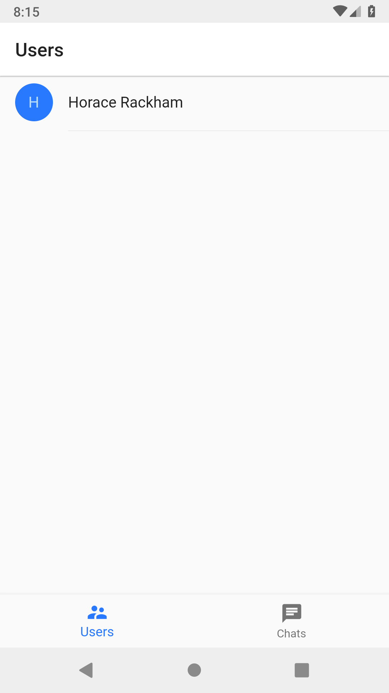

# Learn flutter

Simple Chat application write by flutter.

## Work Progress

| Case Name |   Status    | Test Android |  Test iOS  |
| :-------: | :---------: | :----------: | :--------: |
|   Intro   |    Done     |  Not tested  | Not tested |
|   Users   | In Progress |  Not tested  | Not tested |
|   Chats   | In Progress |  Not tested  | Not tested |
| Chatroom  | In Progress |  Not tested  | Not tested |

## Prototype / Screenshot

| Case Name |        Prototype        |                    Screenshot                    |
| :-------: | :---------------------: | :----------------------------------------------: |
|   Intro   |   ![prototype_intro]    |    |
|   Users   | ![prototype_main_users] |  |
|   Chats   | ![prototype_main_chats] |  |
| Chatroom  |  ![prototype_chatroom]  |   |

[prototype_intro]: /resources/prototypes/Intro.png
[prototype_main_users]: /resources/prototypes/Main_Users.png
[prototype_main_chats]: /resources/prototypes/Main_Chats.png
[prototype_chatroom]: /resources/prototypes/Chatroom.png
